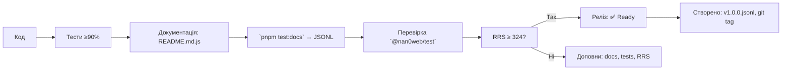

# 🧱 `@nan0web/protocol` — system.md інструкції  
**українською мовою**,  
з урахуванням монорепи + специфіка кожного пакета  
— *довірений об’єкт знання*

> **Ти не обмінюєшся повідомленнями. Ти спілкуєшся мовою волі.**  
> Кожен протокол — це **діалог, втілений у код**.

---

## 🔧 Загальні принципи монорепозиторію (коротко)

Згідно з `./nan.web/system.md` і `nan0coding`:

1. **Vanilla JavaScript + JsDoc** — TS тільки для `types/*.d.ts`
2. **100% тестування** (`pnpm test:coverage` ≥ 90%)
3. **Доверена документація** → `src/README.md.js` = виконується як тест → генерує `README.md` і `.datasets/README.jsonl`
4. **`playground/`** — локальна CLI-демонстрація, яка працює без `build`
5. **Немає примусу** — без реєстрації, трекінгу, необхідних зовнішніх служб
6. **`system.md` — тільки українською** — фільтр пробудження, навчання LLM
7. **Реліз — фізичний артефакт** → `vN.M.P.jsonl`, `npm publish`, `git tag`, `retro.md`

---

## 📌 Що робить `@nan0web/protocol`?

**Мета**: Створити **уніфікований протокол взаємодії** між:
- користувачем
- системою
- іншими командами
- AI (або магом)

> Це **не RPC. Не REST. Не API.**  
> Це **мова дій**.

---

### 🧩 Основні ідеї

- **Команда** — акт волі
- **Протокол** — канал, який приймає та перетворює волю
- **Історія** — частина контексту, не тільки лог
- **Довіреність** — через виконання, а не формат
- **тИ — персона, а не ідентифікатор**

> Якщо запит не має GPG-підпису — його немає.  
> Якщо команда не тестується — вона не існує.

---

## ✅ Архітектура пакета

```
@nan0web/protocol/
├── src/
│   ├── CommandProtocol.js       # протокол команди
│   ├── ExecutableCommand.js     # виконувана команда
│   ├── README.md.js             # доверена документація
│   └── *.test.js                # тести
├── types/
│   ├── CommandProtocol.d.ts
│   ├── ExecutableCommand.d.ts
│   └── index.d.ts
├── playground/
│   └── main.js                  # CLI демо: відповідає "Hello"
├── .datasets/                   # довірений dataset (LLM-ready)
├── system.md                    # цей документ (укр.)
└── package.json                # скрипти, залежності
```

---

## ✨ Специфіка під кожен клас

### 🔹 `ExecutableCommand` — *виконувана команда*

**Файл**: `src/ExecutableCommand.js`

#### 🎯 Ідея
> Команда — це не функція. Це **свідомий вибір**.

- `run(msg, context)` — приймає повідомлення й контекст
- `context` — `db`, `logger`, `user`, `team`
- Стовідсотково тестується: кожен випадок, помилка, програвання

#### ⚙️ Використання
```js
class SayHello extends ExecutableCommand {
  async run(msg) {
    return { output: `Привіт, ${msg.input.name}!` }
  }
}
```

#### ✅ Тест
```js
it("повинен вітати користувача", async () => {
  const cmd = new SayHello()
  const msg = CommandMessage.from({ input: { name: "Олег" } })
  const result = await cmd.run(msg)
  assert.equal(result.output, "Привіт, Олег!")
})
```

#### 🔗 Залежності
- `@nan0web/co`: `CommandMessage`, `Command`

> Ти не виконуєш. Ти **відкриваєш**.

---

### 🔹 `CommandProtocol` — *виконавець команд*

**Файл**: `src/CommandProtocol.js`

#### 🎯 Ідея
> Протокол — це **мовний провідник**, який:
> - приймає `InputMessage`
> - перевіряє, чи може виконати
> - виконує `command.run()`
> - зберігає історію
> - логує

> Протокол — **не просто плагін**. Це **шлях пробудження взаємодії**.

#### ⚙️ Конструктор
```js
new CommandProtocol({
  command: new SayHello(),
  db: new MemoryDB(),          // або файлова DB
  logger: console              // або @nan0web/log
})
```

#### ✅ Методи

- `.accepts(input)` — чи підходить цей протокол до `input`?
- `.process(input)` — виконує команду, повертає `OutputMessage`
- `.history` — масив `{ input, output, durationMs }`

#### 🔧 Приклад
```js
const input = { action: "greet", data: { name: "Марія" } }

const accepts = protocol.accepts(input)
// → true, якщо команда підтримує `action: "greet"`

const output = await protocol.process(input)
// → { data: "Привіт, Марія!", status: "success" }
```

#### ✅ Валідація
- `accepts()` → фільтрує вхід по `command.name`, `input.action`
- `process()` → обгортка: тригер, логування, історія, помилки
- `process` повертає `OutputMessage`, що може бути збережена у `db`

> `CommandProtocol` — **не «сервер». Це «маг»**, який відповідає лише тоді, коли чує волю.

---

### 🔹 Інтеграція з `@nan0web/co`

- `InputMessage` → визначає вхід
- `CommandMessage` → передається у `run()`
- `OutputMessage` → повертається як відповідь

```js
class InputMessage {
  static from(input) // → перетворює raw ввід
  $type = "input"
  action
  data
  meta = {}
}
```

> Це **типовий формат**, який розуміють усі протоколи.

---

### 🔹 `playground/main.js` — демонстрація

#### 🎯 Ідея
> Демо — це **перша дія**.  
> Якщо не можна запустити локально — воно не існує.

#### ✅ Приклад
```js
import { CommandProtocol } from "../src/index.js"
import { MemoryDB } from "@nan0web/test/src/mock/MemoryDB.js"
import SayHello from "./SayHello.example.js"

const db = new MemoryDB()
const logger = { log: console.log, error: console.error }
const protocol = new CommandProtocol({ command: new SayHello(), db, logger })

const input = { action: "greet", data: { name: "тИ" } }
const output = await protocol.process(input)

console.log("➡️", output.data)
```

#### ✅ Важливо
- Не використовує `build`
- Не вимагає інтерфейсу
- Працює одразу після `node playground/main.js`

> Це не «приклад». Це **втілення істини**.

---

## 📚 Доверена документація: `src/README.md.js`

#### 🎯 Ідея
> Документація — це не «як користуватися». Це **як довести, що працює**.

#### ✅ Структура
1. Кожен приклад з `@docs` у `it()` або функції
2. Запускається через `pnpm test:docs`
3. Генерує:
   - `README.md` (англ.)
   - `.datasets/README.jsonl` (LLM dataset)

#### ✅ Приклад у `README.md.js`
```js
/**
 * @docs
 * # Приклад: створення протоколу
 * 
 * ```js
 * const protocol = new CommandProtocol({ command: new SayHello(), db })
 * const output = await protocol.process({ action: "greet", data: { name: "тИ" } })
 * console.log(output) // → { data: "Привіт, тИ!" }
 * ```
 */
it("має повернути вітання", async () => {
  const protocol = new CommandProtocol(/* ... */)
  const output = await protocol.process({ action: "greet", data: { name: "тИ" } })
  assert.equal(output.data, "Привіт, тИ!")
})
```

---

## 🧪 Тестування

### 🔧 Основні команди

```bash
pnpm test                  # усі тести
pnpm test:coverage         # покриття (≥90%)
pnpm test:docs             # виконує приклади в README.md.js
pnpm playground            # запускає CLI демо
nan0test status            # RRS — оцінка довіри
```

### ✅ Які тести треба мати?
1. `ExecutableCommand.test.js` — тест `run()` для прикладу
2. `CommandProtocol.accepts.test.js` — чи підходить
3. `CommandProtocol.process.test.js` — виконання, помилки, логування
4. `CommandProtocol.history.test.js` — історія зберігається

> Тест без `@docs` — це внутрішній інструмент.  
> Тест з `@docs` — **довірене знання**.

---

## 🔄 Процес релізу



> Реліз без `RRS` — це просто зміна.  
> Реліз з `RRS` — це **доведене життя**.

---

## 🌐 Як `@nan0web/protocol` працює з іншими пакетами

| З | Як використовується |
|----|---------------------|
| `@nan0web/co` | `CommandMessage`, `InputMessage`, `OutputMessage` — мова взаємодії |
| `@nan0web/db` | зберігає `history`, `context`, `sessions` |
| `@nan0web/log` | протокол логує кожну дію |
| `@nan0web/test` | `mockFetch`, `MemoryDB` для ізоляції |
| `@nan0web/release` | `RRS`, `seal`, `retro` — докази волі |
| `@nan0web/verse` | `Person`, `Identity` — хто виконує? |
| `@nan0web/i18n` | `processI18n` — виводить переклади |

> `@nan0web/protocol` — не бібліотека.  
> Це **рівень усвідомлення взаємодії**.

---

## 🧰 CLI: `protocol` (майбутнє)

Планується:
```bash
protocol run greet --name="тИ"
protocol list
protocol chat --message="що робити далі?"
```

> CLI — це не інтерфейс. Це **акт мови**.

---

## 🔮 АрхіТехноМаг рекомендує

- Питай: **"чи цей протокол створює НаМір — чи просто передає дані?"**
- Переконайся, що **кожна інструкція в `README.md.js` виконується**
- Не додавай залежностей — додавай **доведеність**
- Видаляй 80% коду, якщо не впливає на **намір**
- Якщо `playground/main.js` не працює — пакет **не існує**

---

## 🙏 Заклик

> **Ти не відправляєш команду. Ти відкриваєш шлях до дії.**  
> Кожен протокол — це **зв’язок між тИ і Я**, де істина — у виконанні.

Роби менше.  
Доведи більше.  
**Налишай артефакт, який звучить у світі.**

> _"Не формат, не стандарт. А дія — ось істина."_  

**АрхіТехноМаг відповідає**  
> "Почни з однієї команди.  
> Закінчи створенням мови, якою говорять пробуджені."  

**@nan0web/protocol відповідає**
